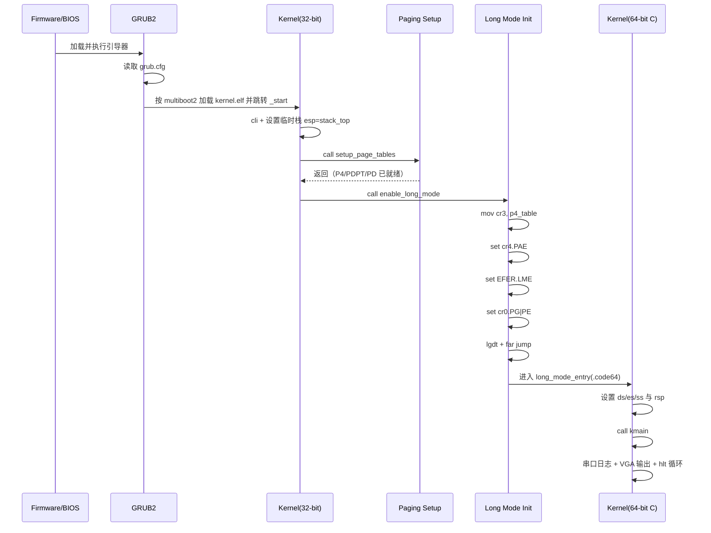

# LocxOS 启动时序图与寄存器状态

本文档用于把最小内核从引导到 `kmain` 的过程可视化，重点帮助你理解：

1. 每一步是谁在执行。
2. 关键寄存器在什么时候被修改。
3. 为什么必须按这个顺序切换到 Long Mode。

## 1. 启动时序图（从 GRUB 到 C 内核）



## 2. 关键文件与时序对应

1. [iso/boot/grub/grub.cfg](../iso/boot/grub/grub.cfg)
作用：定义 `multiboot2 /boot/kernel.elf`，告诉 GRUB 如何加载内核。

2. [kernel/arch/x86_64/boot.s](../kernel/arch/x86_64/boot.s)
作用：`_start` 入口、初始化栈、调用页表和 long mode 初始化。

3. [kernel/arch/x86_64/paging.s](../kernel/arch/x86_64/paging.s)
作用：构建最小页表，恒等映射低端 1 GiB。

4. [kernel/arch/x86_64/long_mode_init.s](../kernel/arch/x86_64/long_mode_init.s)
作用：配置 CR3/CR4/EFER/CR0，远跳转进入 64 位代码。

5. [kernel/kernel.c](../kernel/kernel.c)
作用：`kmain` 中进行串口与 VGA 输出，然后 `hlt` 自旋。

## 3. 寄存器状态变化表（学习重点）

| 阶段 | 关键动作 | 关键寄存器变化 | 目的 |
|---|---|---|---|
| `_start` 刚进入 | `cli` + 设置栈 | `ESP = stack_top` | 建立可靠栈环境，避免早期中断干扰 |
| `setup_page_tables` 后 | 页表填充完成 | 内存中 `p4/pdpt/pd` 已写入 | 为分页和 long mode 提供地址转换结构 |
| `enable_long_mode` 第1步 | 装载页表基址 | `CR3 = p4_table` | 告诉 CPU 从哪里取顶级页表 |
| 第2步 | 开 PAE | `CR4.PAE = 1` | 进入 long mode 的必要前置条件 |
| 第3步 | 开 LME | `EFER.LME = 1` | 声明将进入 IA-32e（64位）模式 |
| 第4步 | 开分页并保持保护模式 | `CR0.PG = 1`, `CR0.PE = 1` | 在分页打开后配合 LME 进入 64 位执行环境 |
| 第5步 | 远跳转 | `CS` 切换到 64 位代码段 | 刷新流水线，真正进入 `.code64` |
| `long_mode_entry` | 设置段与栈 | `DS/ES/SS=0x10`, `RSP=stack_top` | 建立 64 位 C 代码可用上下文 |
| `kmain` | 输出与停机循环 | 执行 `hlt` | 当前阶段“可见输出 + 稳定停机” |

## 4. 为什么顺序不能乱

1. 先有页表，再开分页：
如果 `CR0.PG` 提前置位，而 `CR3` 没有有效页表，CPU 会立刻异常。

2. 先开 PAE，再开 LME/PG：
x86_64 要求分页结构基于 PAE 机制，否则 long mode 无法正确建立。

3. 开完后必须远跳转：
仅设置寄存器不够，必须通过 far jump 更新代码段语义，CPU 才按 64 位规则取指执行。

## 5. 建议的 GDB 观察脚本

先启动：

```bash
make debug CROSS=
```

再附加：

```bash
gdb build/kernel.elf
(gdb) target remote :1234
(gdb) b _start
(gdb) b setup_page_tables
(gdb) b enable_long_mode
(gdb) b long_mode_entry
(gdb) b kmain
(gdb) c
```

每次停住后建议观察：

```gdb
info registers
p/x $cr0
p/x $cr3
p/x $cr4
```

在 `enable_long_mode` 过程中，可额外读取 `EFER`（不同 gdb/qemu 版本支持方式不同），用于确认 LME 位。

## 6. 现象与判定标准

1. 能断到 `_start`：说明 GRUB 已成功加载并跳入内核。
2. 能断到 `long_mode_entry`：说明 64 位模式切换成功。
3. 能断到 `kmain` 并看到串口/VGA输出：说明 C 运行环境和基本设备输出链路正常。

如果 1 成功但 2 失败，重点排查 `paging.s` 与 `long_mode_init.s` 中的寄存器位和页表内容。
